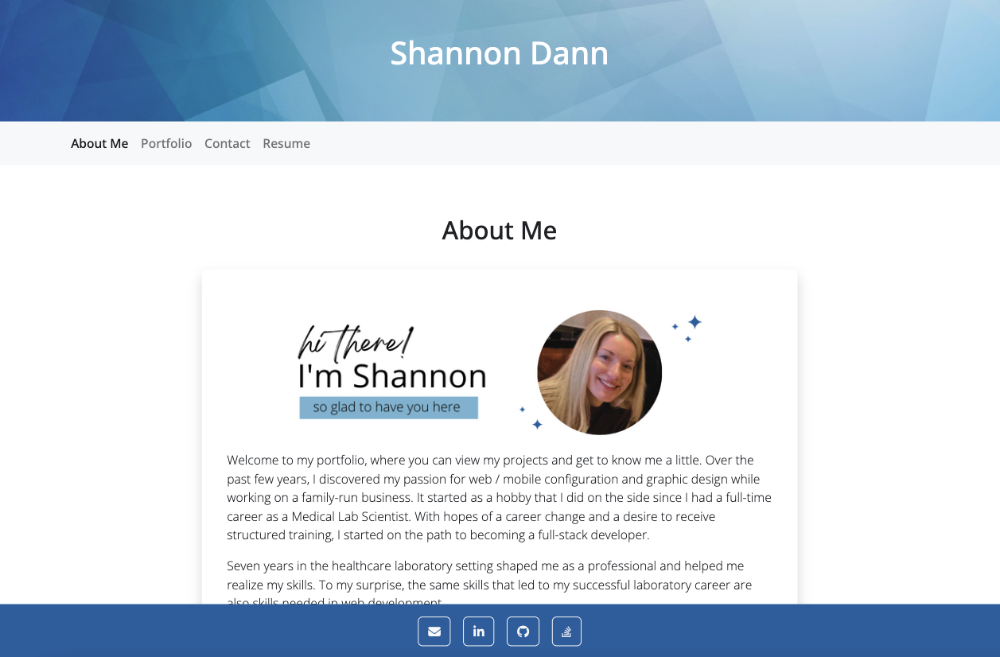
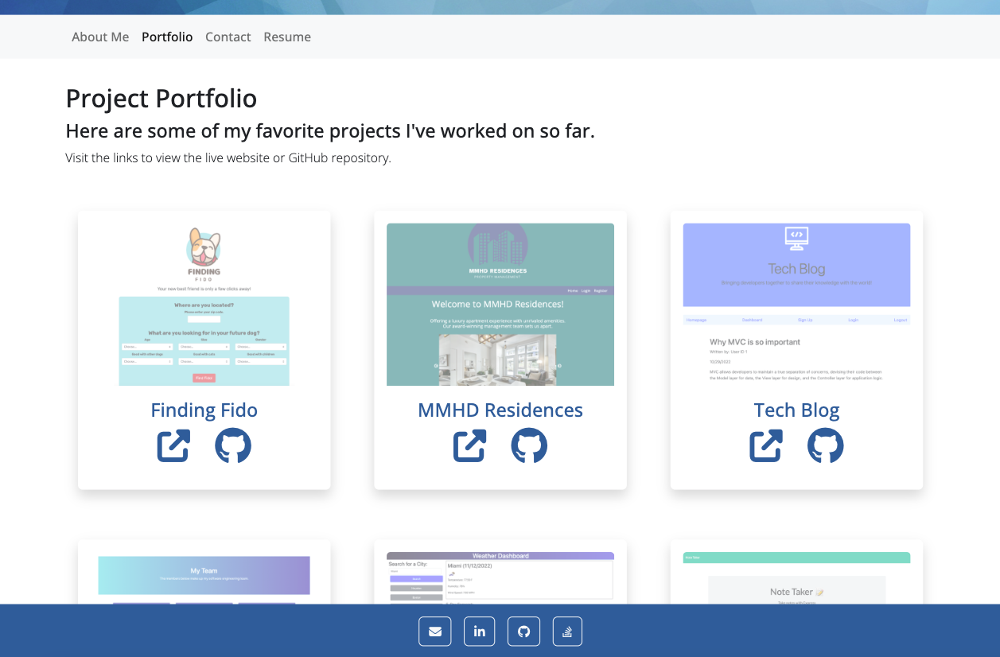

# Shannon's Project Portfolio

## Description

My project portfolio is where you can learn a little about me, view my work, contact me, and view my resume. This single-page web application was built with React. Features of React Bootstrap, Material Design for Bootstrap, and Chakra UI were used for the layout and design.

## Table of Contents

- [Installation](#installation)
- [Usage](#usage)
- [License](#license)
- [Contributing](#contributing)
- [Tests](#tests)
- [Questions](#questions)

## Installation 

Installation is not required as this application has been deployed to a live URL. To see it in action, please visit the link below.

## Usage 

The purpse of this application is to provide a place to showcase my work to potential employers. It consists of 4 main sections: 

An about me section gives a brief bio about my career and aspirations, as well as a highlight of my skills.

The portfolio section displays 6 of my projects.

* Each project has an image, a title, a link to the deployed website, and a link to the GitHub repository.

A contact section has a form with input fields for a name, an email address, and a message.

* Form validation requires that each field be filled out upon submission and the email input requires a valid email adress.

Lastly, a resume section lists my front-end and back-end technology proficiencies. A PDF version of my resume is also available for download.

[Deployed Application](https://smdann.github.io/project-portfolio/)

## License 

Shannon's Project Portfolio is available under the MIT license.

Please see [LICENSE](./LICENSE) for the full details.

## Contributing 

The contributors of this application have adopted the Contributor Covenant Code of Conduct. Please visit the [Code of Conduct](./CODE_OF_CONDUCT) page for details.

## Tests 

This application doesn't have any tests at this time.

## Questions 

Please reach out via the the link below with any additional questions. 

[GitHub](https://github.com/smdann)
